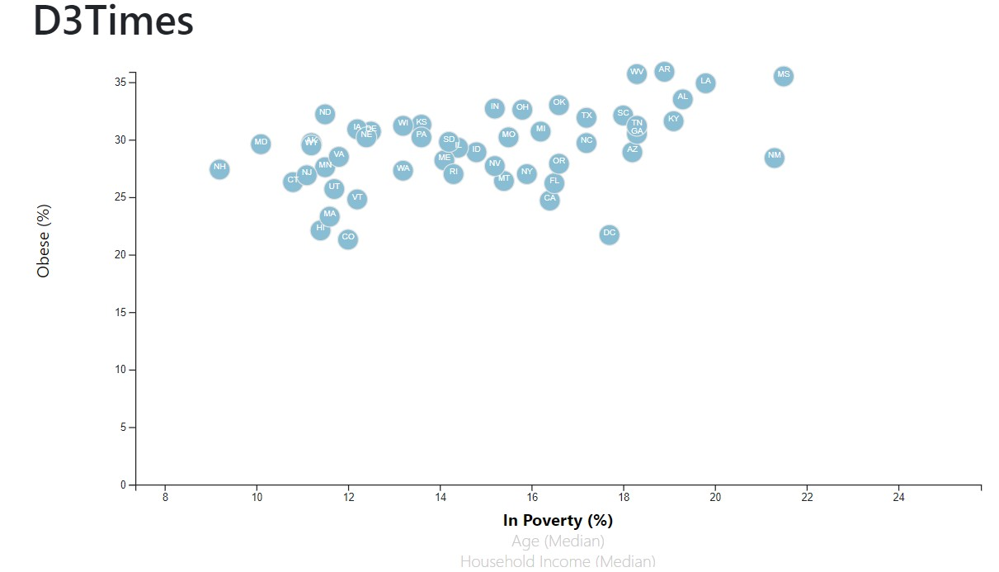
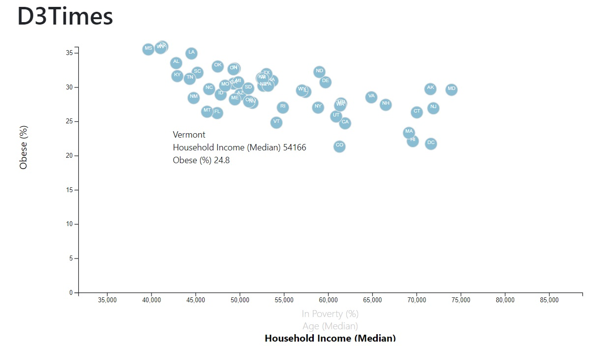

# D3 - Demographic Health Risks

Welcome to the newsroom! You've just accepted a data visualization position for a major metro paper. You're tasked with analyzing the current trends shaping people's lives, as well as creating charts, graphs, and interactive elements to help readers understand your findings.
The editor wants to run a series of feature stories about the health risks facing particular demographics. She's counting on you to sniff out the first story idea by sifting through information from the U.S. Census Bureau and the Behavioral Risk Factor Surveillance System.
The data set included with the assignment is based on 2014 ACS 1-year estimates: https://factfinder.census.gov/faces/nav/jsf/pages/searchresults.xhtml, but you are free to investigate a different data set. The current data set includes data on rates of income, obesity, poverty, etc. by state. MOE stands for "margin of error."


## Repository Structure
```
project  
|__ images/                # contains image of final visualisation created
|
|__ static/                              
|         |_ css/          # contains css styling sheet
|         |_ data/         # contains data source csv
|         |_ js/           # contains logic to create leaflet visualisation
| 
|
|__ index.html             # html file used to render page template
|
|__ README.md              # readme file

```


## Task
- Create a scatter plot between two of the data variables
- Using the D3 techniques create a scatter plot that represents each state with circle elements. 
   - Include state abbreviations in the circles.
   - Create and situate your axes and labels to the left and bottom of the chart.



## Bonus
- Place additional labels in your scatter plot and give them click events so that your users can decide which data to display. 
- Animate the transitions for your circles' locations as well as the range of your axes.
- Incorporate [d3-tip.js](https://github.com/caged/d3-tip) plugin to add display a tooltip when hovering over the data

